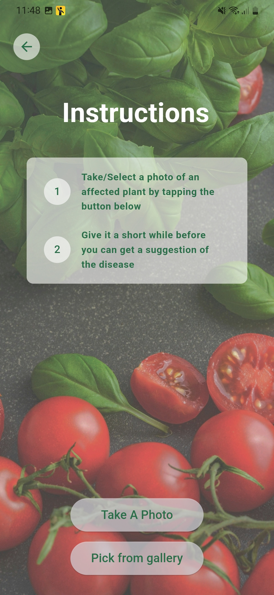
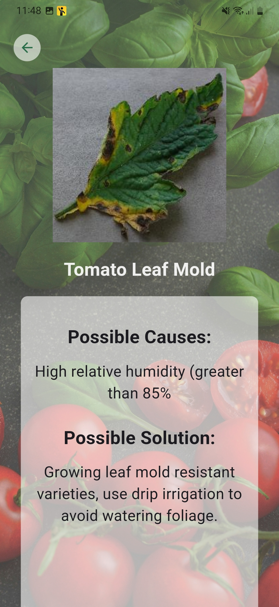
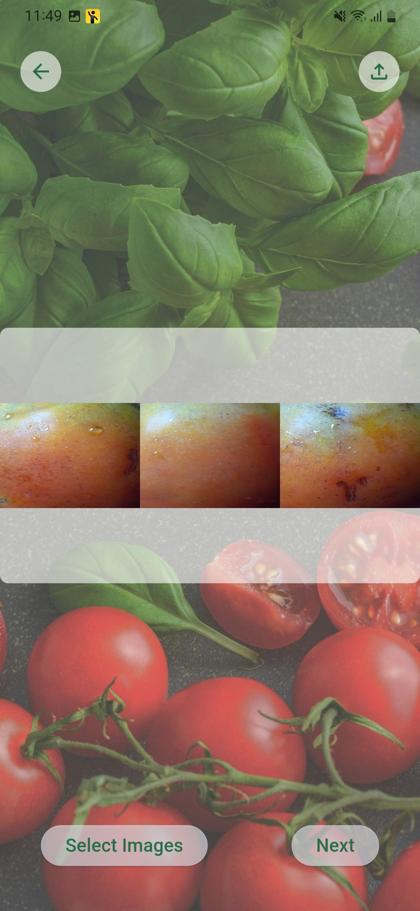

# Tomato Disease Detector using ML models and 3D technology.

This project allow users to detect diseases of tomato fruits and leaves using 3D models and trained machine learning model.


## Screenshots








## Technologies Used

Flutter: Cross-platform framework for building mobile applications.

Dart: Programming language used with Flutter for writing application code.

Firebase: Backend platform used for user authentication, real-time database and cloud storage.


## Installation

Cloning the Repository

Copy this URL - ```https://github.com/pasindur2000/pusl_3119.git ```

Open Terminal or Command Prompt

Navigate to Desired Directory: Use the cd command to navigate to the directory where you want to store your project.

Clone Repository -
```git clone [repository-url] ```

Navigate into Project Directory -
```cd [project-folder-name] ```
  


    